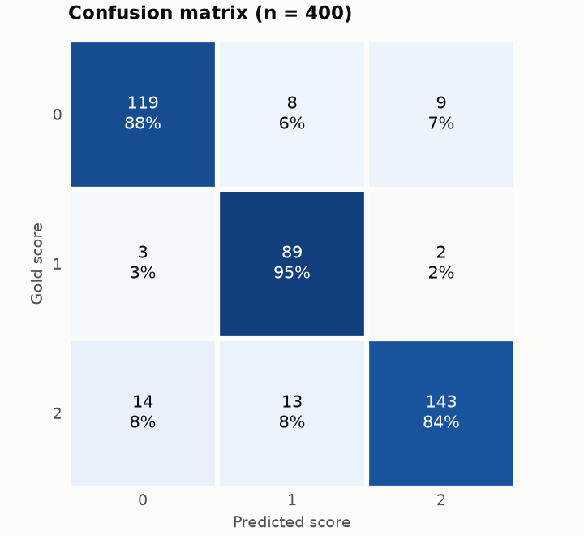
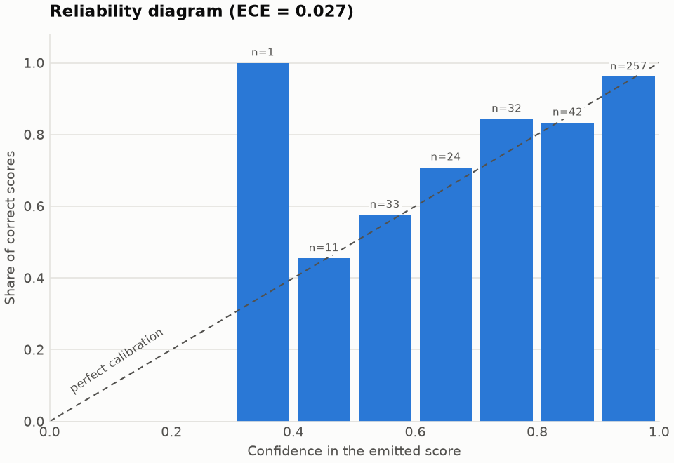
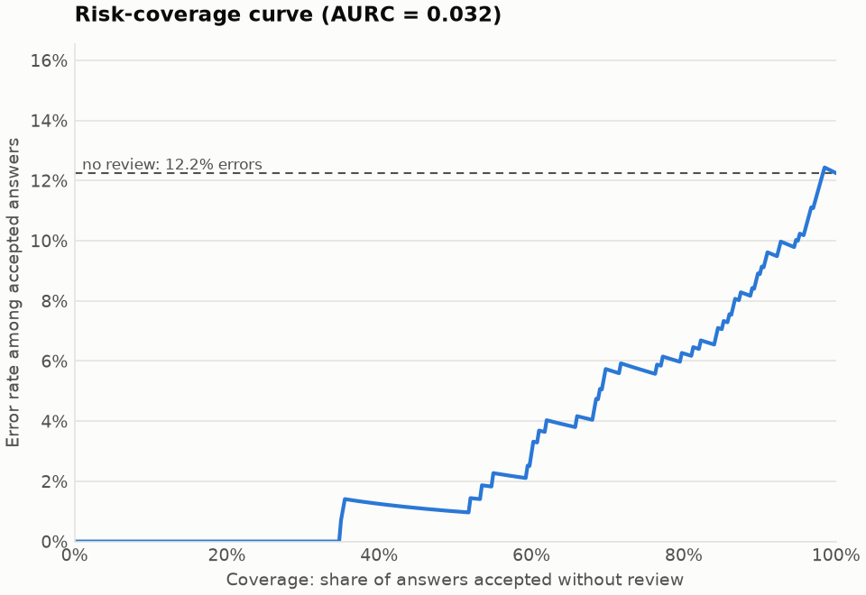

# Evaluation of `sample_predictions.jsonl`

- Answers: 400 (400 scored, 0 without a parsed score) from 40 questions
- Input SHA-256: `fb239a1ab18fd121b6306c064cf6c0074ac6973a4a63a22cecd924d8ee5f53fc`
- Intervals: 95% percentile bootstrap over questions, 2000 resamples, seed 0
- Tool: asag-eval 0.1.0

## Agreement with the gold scores

| Metric | Value | 95% CI |
| --- | --- | --- |
| Quadratic weighted kappa (QWK) | 0.801 | [0.709, 0.886] |
| Cohen's kappa | 0.813 | [0.730, 0.894] |
| Macro-F1 | 0.877 | [0.820, 0.931] |
| Accuracy | 0.877 | [0.823, 0.930] |
| Mean absolute error | 0.180 | [0.102, 0.260] |
| Extreme error rate | 0.058 | [0.033, 0.087] |

## Confusion matrix

Rows are gold scores, columns are predicted scores.

| Gold \ Predicted | 0 | 1 | 2 |
| --- | --- | --- | --- |
| **0** | 119 | 8 | 9 |
| **1** | 3 | 89 | 2 |
| **2** | 14 | 13 | 143 |

## Per-score results

| Score | Precision | Recall | F1 | Gold answers | Predicted |
| --- | --- | --- | --- | --- | --- |
| 0 | 0.875 | 0.875 | 0.875 | 136 | 136 |
| 1 | 0.809 | 0.947 | 0.873 | 94 | 110 |
| 2 | 0.929 | 0.841 | 0.883 | 170 | 154 |

## Calibration and selective prediction

| Metric | Value | 95% CI |
| --- | --- | --- |
| Expected calibration error (ECE) | 0.027 | [0.020, 0.059] |
| Brier score | 0.191 | [0.120, 0.265] |
| Negative log-likelihood | 0.352 | [0.231, 0.484] |
| Area under the risk-coverage curve (AURC) | 0.032 | [0.013, 0.058] |

Answers whose emitted score is not the most probable one: 0.

Accepting only answers at or above a confidence threshold and sending the rest to a teacher:

| Coverage | Answers | Lowest confidence | Accuracy | QWK | Extreme errors |
| --- | --- | --- | --- | --- | --- |
| 100% | 400 | 0.399 | 0.877 | 0.801 | 0.058 |
| 90% | 360 | 0.582 | 0.911 | 0.859 | 0.039 |
| 80% | 320 | 0.740 | 0.938 | 0.899 | 0.028 |
| 70% | 280 | 0.853 | 0.943 | 0.911 | 0.025 |
| 50% | 200 | 0.960 | 0.990 | 0.983 | 0.005 |

